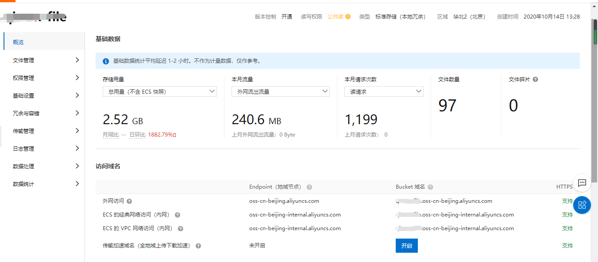
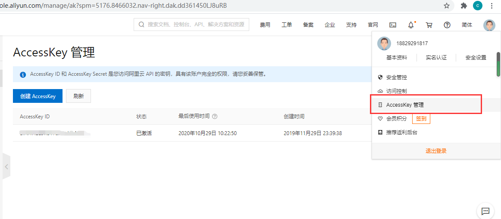
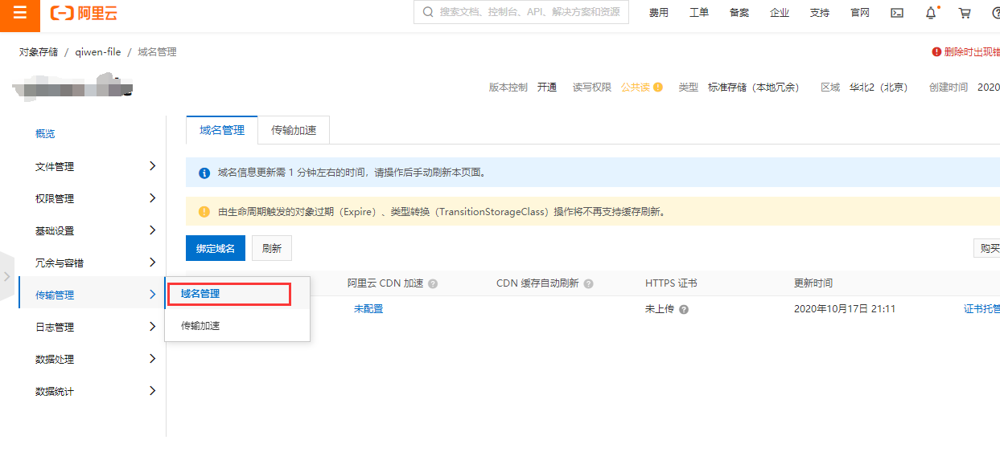

# 后台项目配置

> 奇文网盘目前支持三种存储方式，本地磁盘存储、阿里云OSS存储及FastDFS存储，默认情况下是使用本地磁盘存储，那么如何切换到另外两种存储模式呢？下面进行详细介绍

## 切换存储方式

### 阿里云OSS存储

#### 开通阿里云OSS对象存储
点击[阿里云官网](https://promotion.aliyun.com/ntms/yunparter/invite.html?userCode=c3m9d2cm)，开通阿里云OSS对象存储

#### 创建bucket
点击进入OSS管理控制台，创建bucket
创建完成之后，点击bucket列表目录，进入到概览页面



#### 奇文网盘配置
点击resource目录，打开application.properties，配置如下节点
#### 配置存储方式
将qiwen-file.storage-type修改为1
```properties
qiwen-file.storage-type=1
```
#### 配置阿里云OSS信息
```properties
#阿里云oss基本配置
qiwen-file.aliyun.oss.endpoint=
qiwen-file.aliyun.oss.access-key-id=
qiwen-file.aliyun.oss.access-key-secret=
qiwen-file.aliyun.oss.bucket-name=
#阿里云oss绑定域名
qiwen-file.aliyun.oss.domain=

```
#### 参数说明
|属性|说明|参数示例|
|-|-|-|
|qiwen-file.aliyun.oss.enabled|是否开启OSS对象存储|true/false|
|qiwen-file.aliyun.oss.endpoint|Endpoint以杭州为例，其它Region请按实际情况填写|https://oss-cn-hangzhou.aliyuncs.com|
|qiwen-file.aliyun.oss.access-key-id|阿里云 API 的密钥|********|
|qiwen-file.aliyun.oss.access-key-secret|阿里云 API 的密钥|********|
|qiwen-file.aliyun.oss.bucket-name|bucketName||
|qiwen-file.aliyun.oss.domain|阿里云oss绑定域名||

### FastDFS存储
#### 搭建FastDFS集群
略
#### 奇文网盘配置
点击resource目录，打开application.properties，配置如下节点
#### 配置存储方式
将qiwen-file.storage-type修改为1
```properties
qiwen-file.storage-type=1
```
#### FastDFS配置
```properties
#FastDFS配置
fdfs.so-timeout=1501
fdfs.connect-timeout=601
fdfs.thumb-image.width=150
fdfs.thumb-image.height=150
fdfs.tracker-list=127.0.0.1:22122 
```

## 配置文件保存路径
### 开发环境配置
当后台在开发工具中启动时，文件上传之后默认会保存到target目录下，这里我以IDEA为例，文件默认保存位置为 `target/classes/static/upload/`,如下图：


### 生产环境配置

生产环境一般是将项目打包之后，放到服务器上运行，那么此时文件保存路径则在部署路径下的`static/upload/`下，如下图：


### 修改文件保存位置
奇文网盘默认保存文件是在服务器的static目录下保存文件，那么如何将文件保存在自定义路径下呢？其实很简单，操作如下：

打开resource/config目录下的application.properties目录，并在该配置文件中添加如下属性：

```java
qiwen-file.local-storage-path=D:/export
```
注意：
该路径一旦配置则默认生效，整个服务器保存都会切换到该路径下
如果该属性值为空或者该属性不存在，则系统默认保存文件到服务器的static目录下


奇文网盘目前支持开发和生产环境两套配置，使用开发环境配置默认使用的是H2嵌入式数据库，使用生产环境配置连接MySql数据库。

## 开发/生产配置
当我们在进行开发的过程中，可以根据需要对环境进行切换，默认配置为 `dev`

### 环境切换dev/prod


### 生产配置

当发布版本之后，在环境上如果需要对环境进行切换，可修改如下配置：
打开 bin 路径下 `start.sh` 文件，设置如下配置项，即可进行切换：

```shell
SPRING_PROFILES_ACTIVE="prod"
```
### 注意事项

在开发及生产环境，如果使用H2数据库，需要注意H2数据库文件保存路径是否存在，根据实际需要进行调整，具体修改位置为，`application-dev.properties` 文件，修改如下图路径：


## 文件搜索配置
### 安装ElasticSearch服务
#### 下载安装
点击[官网下载](https://www.elastic.co/cn/downloads/elasticsearch)，根据自己的服务器类型，选择合适的安装包进行下载后安装

#### windows环境启动
在windows环境下，点击bin目录下elasticsearch.bat启动
#### linux环境启动和停止
```shell
sudo -i service elasticsearch start
sudo -i service elasticsearch stop
```
### 奇文网盘配置

打开 `application.properties` 文件，在文件中修改如下脚本：

```properties
spring.data.elasticsearch.client.reactive.endpoints=127.0.0.1:9200
spring.elasticsearch.rest.uris=127.0.0.1:9200
```
## FAQ
### 如何查看阿里云API密钥


### OSS绑定域名
不绑定域名也是可以的，但是网盘无法进行预览，建议创建一个子域名进行绑定。



