# 功能说明

本系统的用户需要自行注册并登录。

## 注册

注册页面提供滑动解锁插件，在输入用户名、手机号、密码之后，点击注册就可以注册成功。


## 登录

输入手机号和密码，滑动解锁，点击登录按钮即可登录


## 网盘主页

网盘主页采用经典的左右布局。

### 页面布局

- 左侧菜单栏区域：展示文件类型，点击可以分类查看文件，底部显示已占用存储空间。
  1. 点击左侧分类栏中的**全部**，右侧文件列表会随面包屑导航栏中的当前位置变化而变化，调用后台接口，传参当前位置 & 分页数据，获取当前路径下 & 当前页的文件列表。
  2. 点击左侧分类栏中的**图片、文档、视频、音乐、其他**，面包屑导航栏将显示当前文件类型，右侧文件列表会随左侧分类栏的切换而变化，调用后台接口，传参当前点击的文件类型 & 分页数据，获取当前文件类型 & 当前页的文件列表。
- 顶部文件操作区域：包括对文件的操作按钮组、文件查看模式切换按钮组、设置文件显示列按钮。
- 右侧文件展示区域：包括面包屑导航栏——标识当前位于的目录；文件展示区域——展示形式会随文件查看模式而改变；底部分页组件。

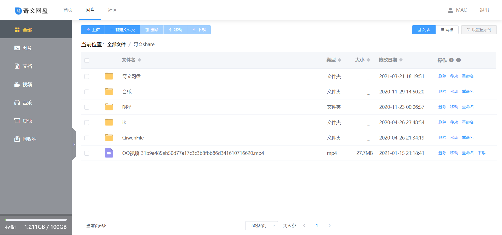

### 布局调整功能

左侧菜单栏可折叠，表格操作列可折叠，可控制当前表格中列的显示和隐藏

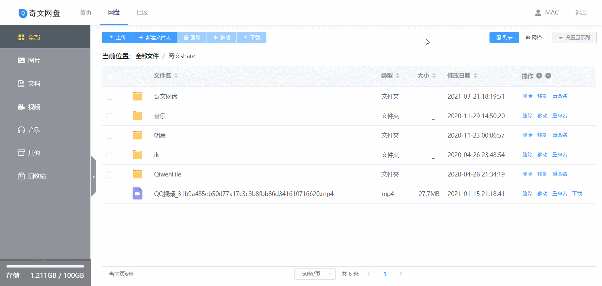

### 批量操作功能

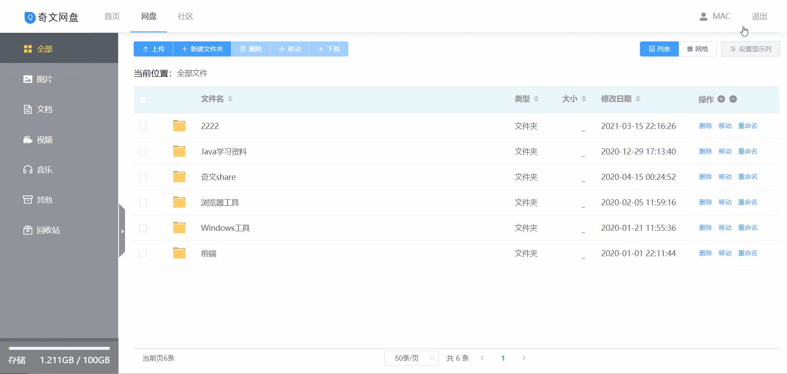

## 三种查看模式

文件查看支持三种展示模式（列表、网格和时间线模式）

### 列表模式

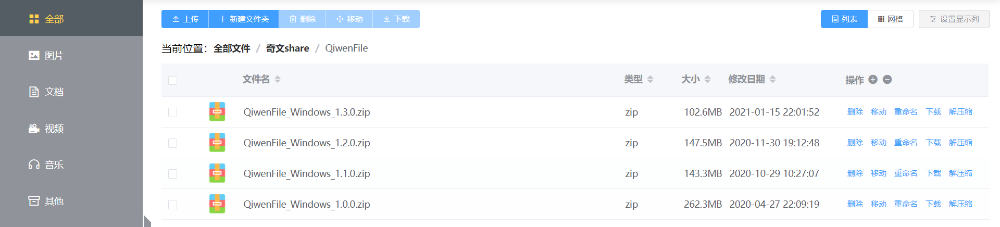

### 网格模式

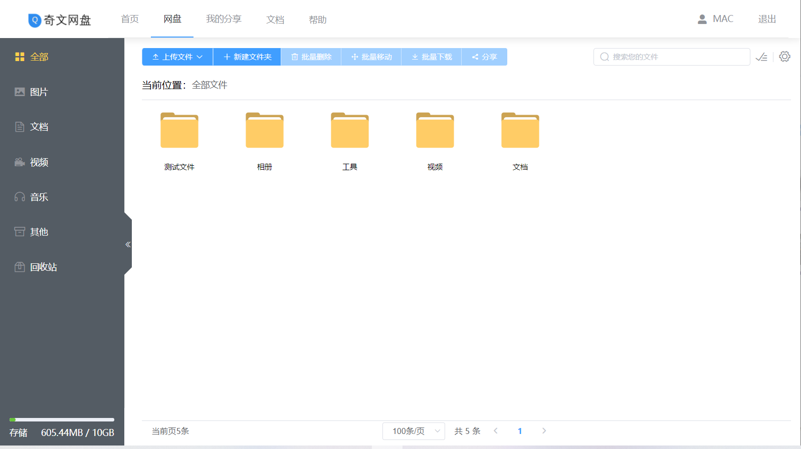

### 时间线模式

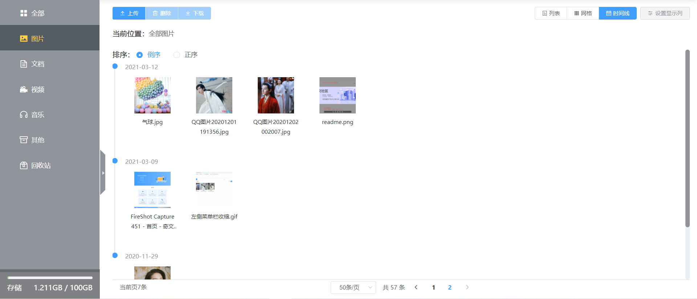

## 创建文件夹

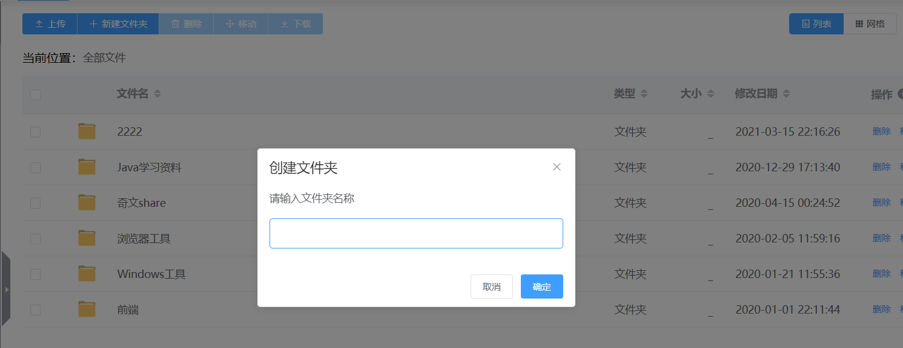

## 文件图标大小调整

在网格模式和时间线模式下，支持手动调整图标大小：

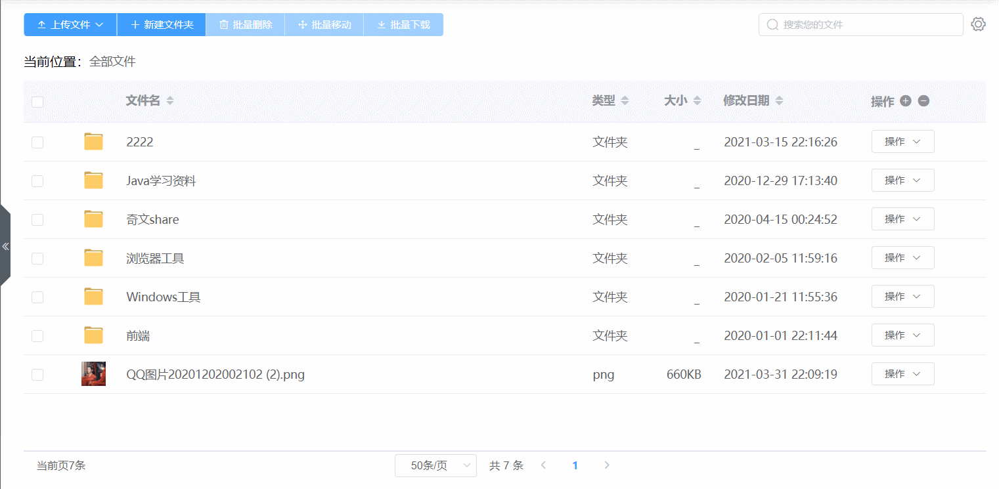

## 文件移动

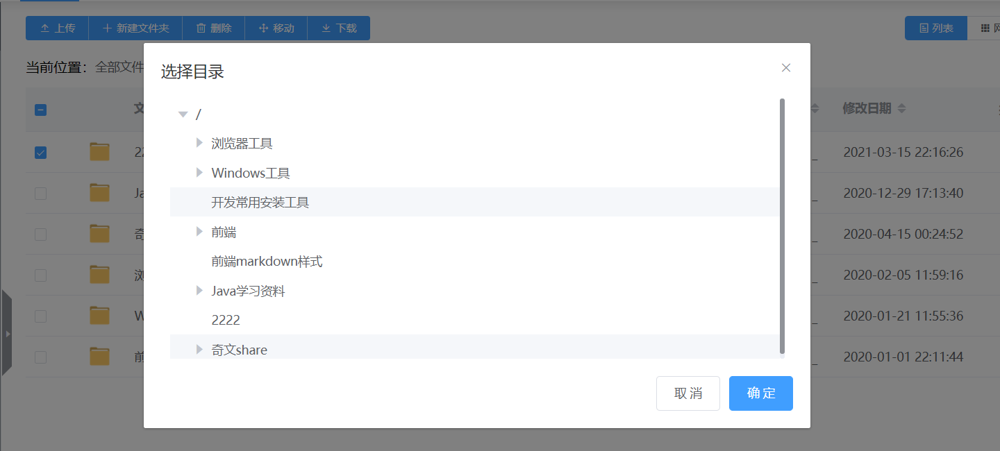

## 文件在线解压缩

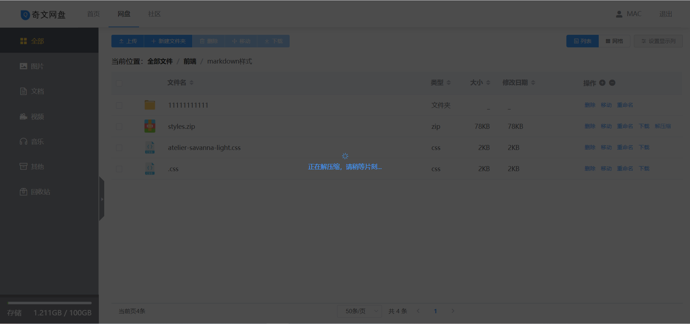

## 文件上传三种方式

### 文件分片上传

文件采用**分片上传**，集成了[simiple-uplader](https://github.com/simple-uploader/Uploader/blob/develop/README_zh-CN.md#uploader)的文件**秒传**、**断点续传**功能。
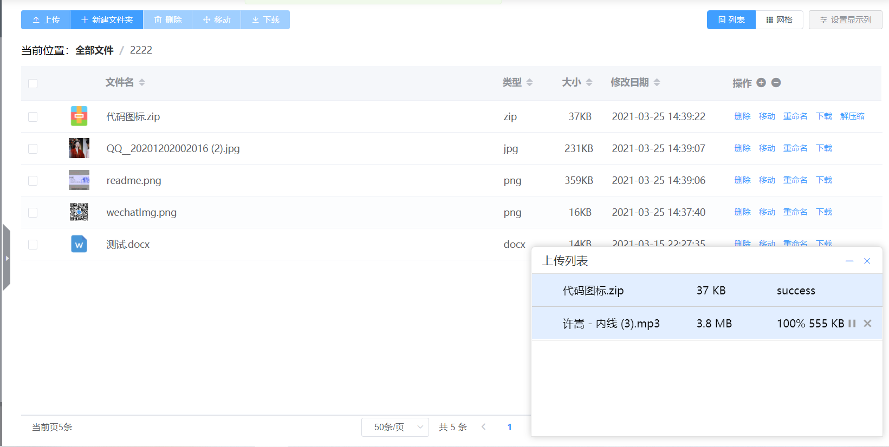

### 拖拽上传

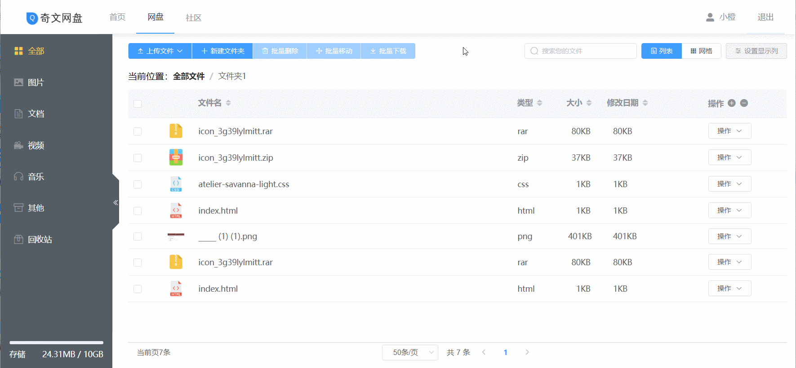

### 截图粘贴上传

直接使用任何截图工具截图后，在拖拽区域使用 Ctrl + V 粘贴图片，点击上传图片即可上传。


## 文件回收站

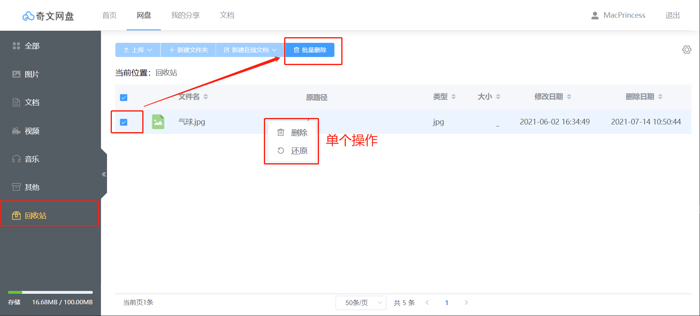

## 文件单个和批量分享

1. 支持单个和批量分享文件给他人：

   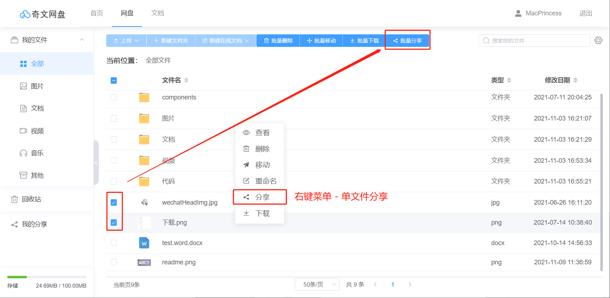

2. 可以选择过期时间和是否需要提取码：

   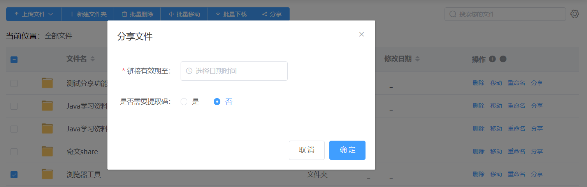

3. 提供快捷复制链接及提取码给他人：

   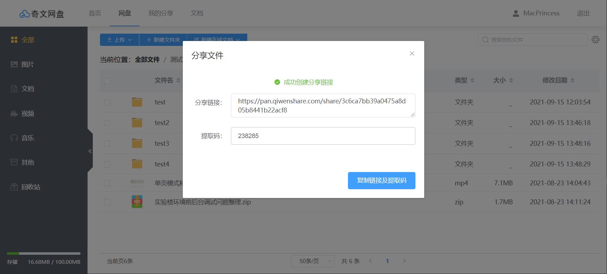

   粘贴分享链接及提取码效果：

   ```
   分享链接：https://pan.qiwenshare.com/share/27d9b438019e4f68bcec02f579d163b7
   提取码：356978
   复制链接到浏览器中并输入提取码即可查看文件
   ```

4. 他人查看分享内容，并支持保存到网盘功能：

   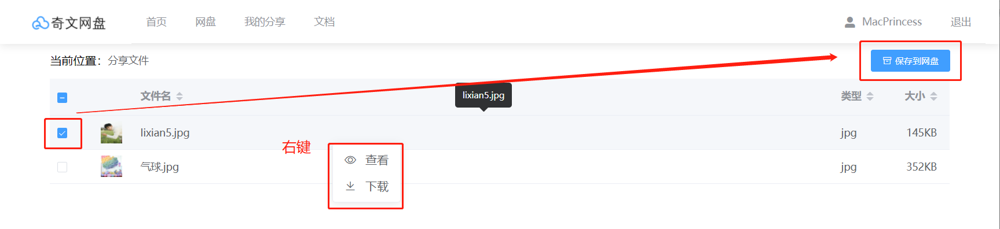

## 支持查看自己已分享过的文件列表

支持在列表中快捷复制当次的分享链接及提取码，并标注分享时间和过期状态：

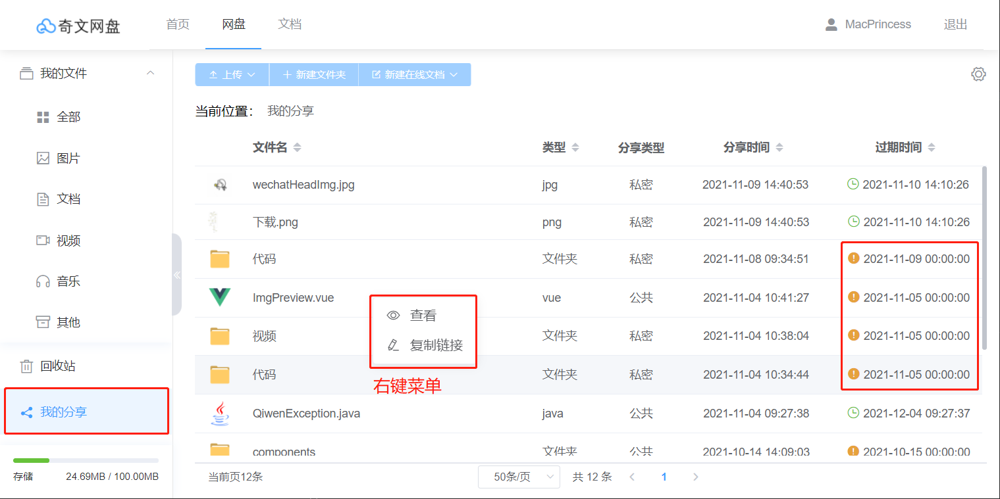

## 视频在线预览

文件类型为视频时，点击即可打开预览窗口，展示播放列表，支持快进、后退、暂停、倍速播放、全屏播放、下载视频和折叠播放列表。

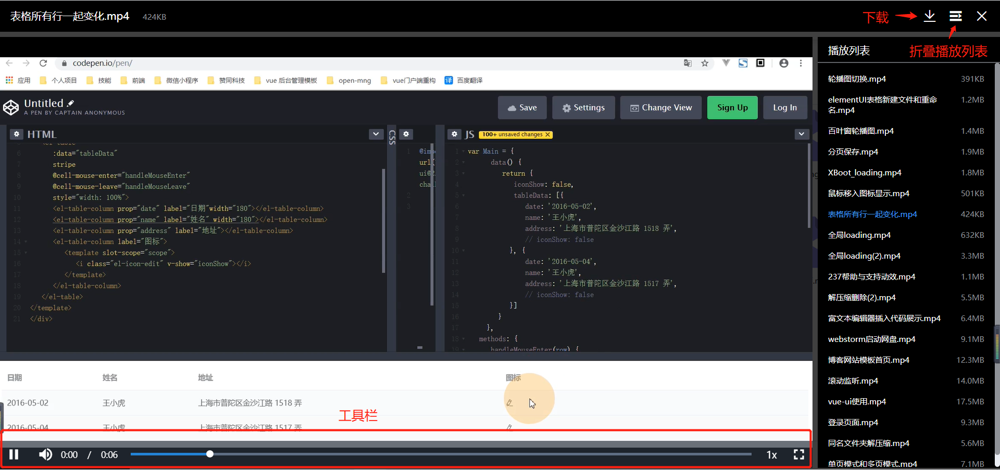

## 音频在线播放

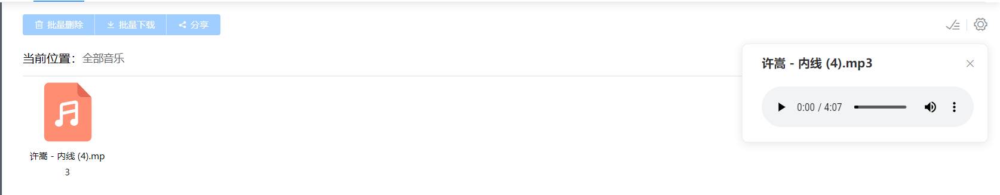