# 功能展示

本系统的用户需要自行注册并登录。

## 注册

注册页面提供滑动解锁插件，在输入用户名、手机号、密码之后，点击注册就可以注册成功。


## 登录

输入手机号和密码，滑动解锁，点击登录按钮即可登录


## 网盘主页

网盘主页采用经典的左右布局。

### 页面布局

- 左侧分类栏区域：展示文件类型，点击可以分类查看文件，底部显示已占用存储空间。
  1. 点击左侧分类栏中的**全部**，右侧文件列表会随面包屑导航栏中的当前位置变化而变化，调用后台接口，传参当前位置 & 分页数据，获取当前路径下 & 当前页的文件列表。
  2. 点击左侧分类栏中的**图片、文档、视频、音乐、其他**，面包屑导航栏将显示当前文件类型，右侧文件列表会随左侧分类栏的切换而变化，调用后台接口，传参当前点击的文件类型 & 分页数据，获取当前文件类型 & 当前页的文件列表。
- 顶部文件操作区域：包括对文件的操作按钮组、文件查看模式切换按钮组、设置文件显示列按钮。
- 右侧文件展示区域：包括面包屑导航栏——标识当前位于的目录；文件展示区域——展示形式会随文件查看模式而改变；底部分页组件。


### 布局调整功能

左侧菜单栏可折叠，可控制当前表格中列的显示和隐藏

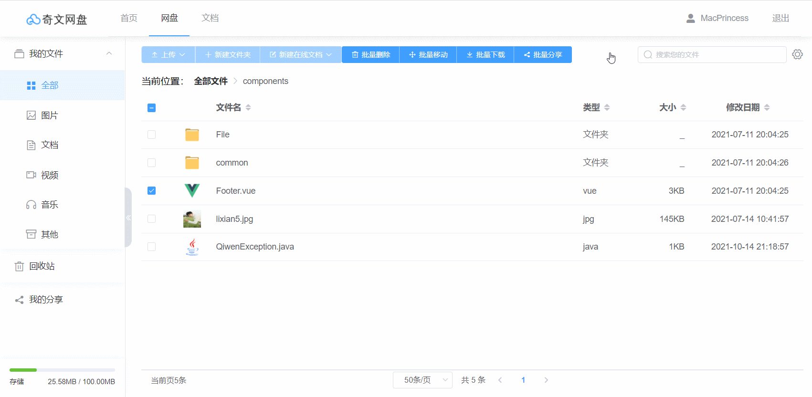

### 文件图标大小调整

在网格模式和时间线模式下，支持手动调整图标大小：

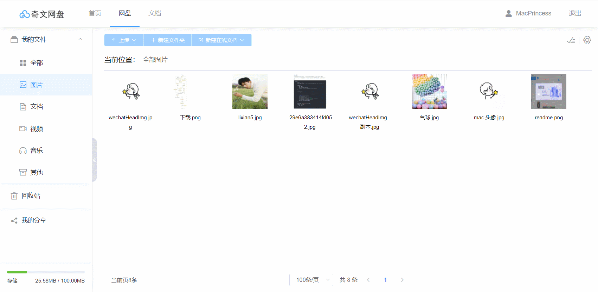

## 三种查看模式

文件查看支持三种展示模式：列表、网格和时间线模式

::: tip

时间线模式目前仅在左侧分类栏选择图片时才支持，我们会尽快支持其他类型的文件

:::

### 列表模式


### 网格模式


### 时间线模式

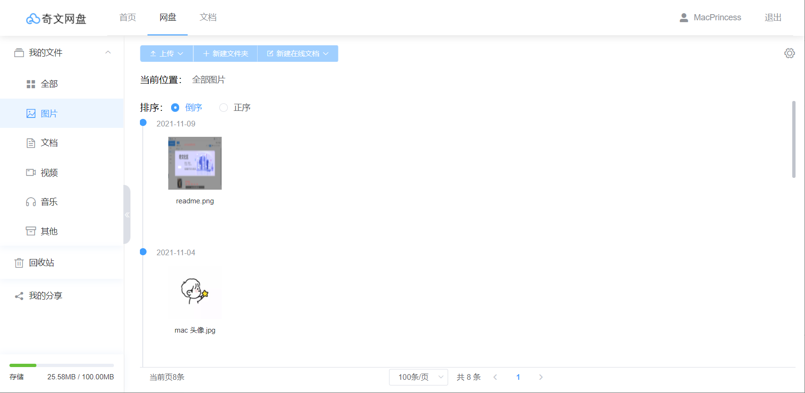

## 文件操作

文件操作结合了电脑客户端的操作方式，支持任何文件右键唤起操作列表，或勾选文件并点击顶部相关批量操作按钮。

### 新建文件夹

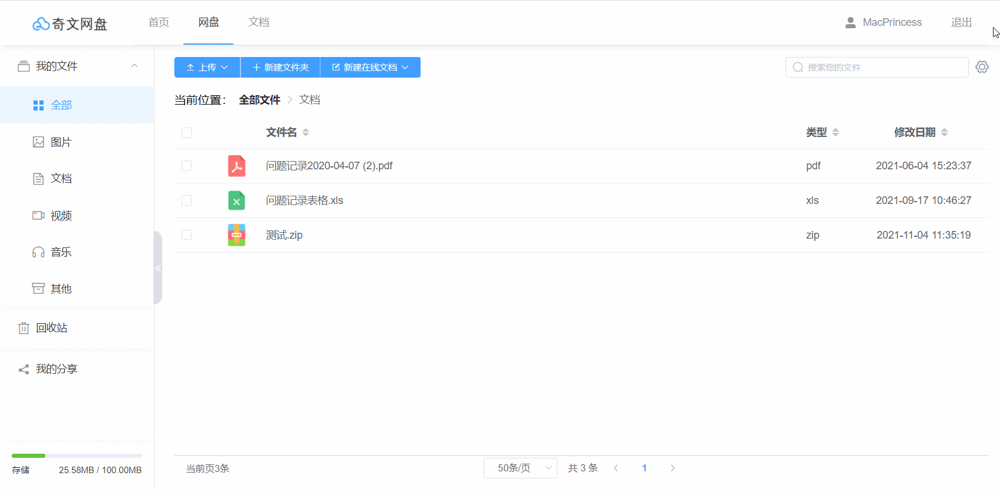

### 文件移动

支持文件单个和批量移动，选择目录后，点击确定即可移动文件到目标路径，同时在弹框中提供新建文件夹功能。

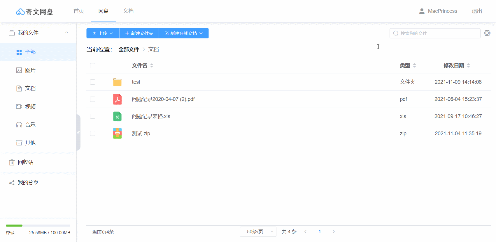

### 文件在线解压缩

支持 ZIP 和 RAR 格式的文件在线解压缩。


### 文件搜索

支持文件名搜索文件，搜索功能后台配置请查看顶部导航栏`配置-后台项目配置-文件搜索配置`


### 批量操作功能

在列表和网格模式下，提供了批量操作功能，可以对文件进行批量删除、移动和下载。

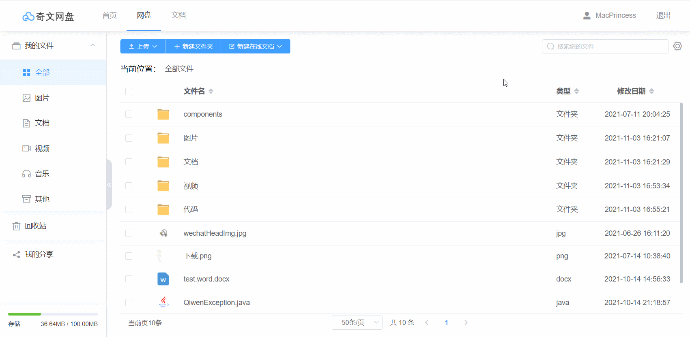

## 三种文件上传方式

### 文件 & 文件夹分片上传

支持**文件**和**文件夹**上传。文件采用**分片上传**，集成了 [simiple-uplader](https://github.com/simple-uploader/Uploader/blob/develop/README_zh-CN.md#uploader) 的文件**秒传**、**断点续传**功能，此插件的具体配置项可以查看该项目的官方文档。
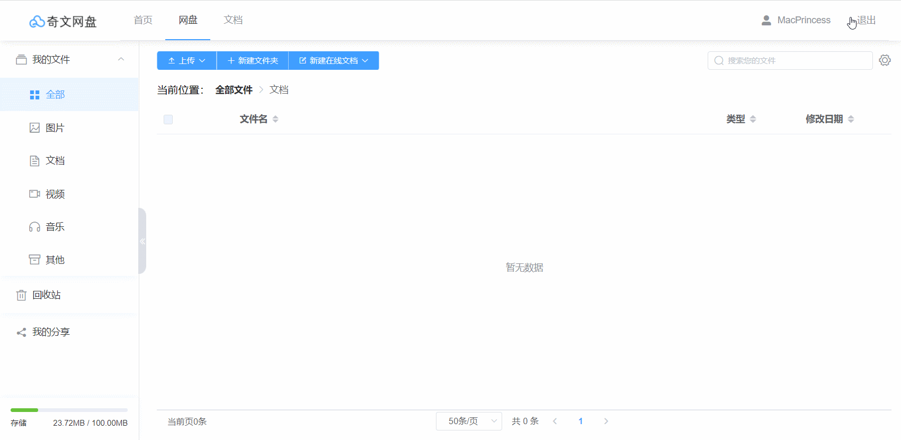

### 拖拽上传

支持全屏区域拖拽上传文件。

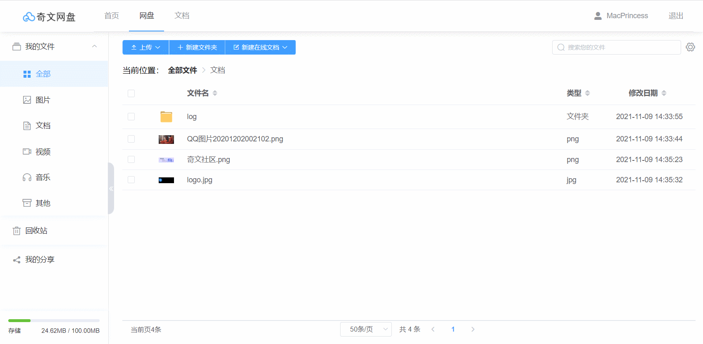

### 截图粘贴上传

直接使用任何截图工具截图后，在拖拽区域使用 Ctrl + V 粘贴图片，点击上传图片即可上传。


## 文件回收站

提供文件回收站功能，支持彻底删除和还原文件。

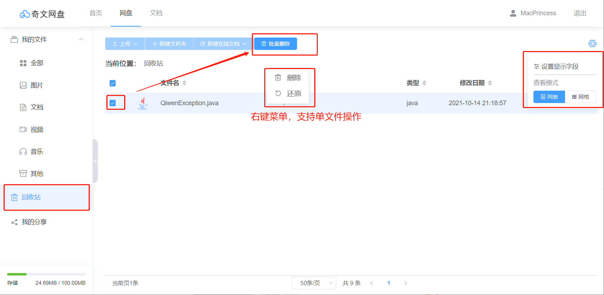

## 文件分享

### 单个或批量文件分享

1. 支持单个和批量分享文件给他人：

   

2. 可以选择过期时间和是否需要提取码：

   

3. 提供快捷复制链接及提取码给他人：

   

   粘贴分享链接及提取码效果：

   ```
   分享链接：https://pan.qiwenshare.com/share/3c6ca7bb39a0475a8d05b8441b22acf8
   提取码：238285
   复制链接到浏览器中并输入提取码即可查看文件
   ```

4. 他人查看分享内容，并支持保存到网盘功能：

   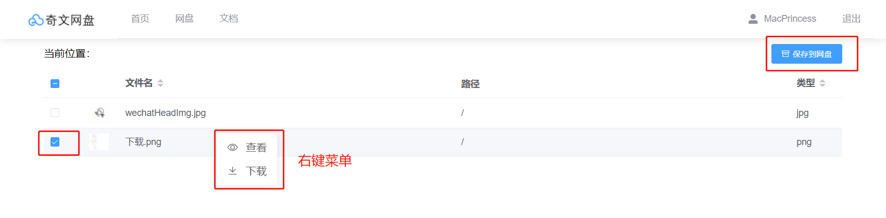

### 查看已分享过的文件列表

支持在列表中快捷复制当次的分享链接及提取码，并标注分享时间和过期状态：


## 文件在线预览 & 编辑

### office 在线预览 & 编辑

例如：word 文件在线预览：
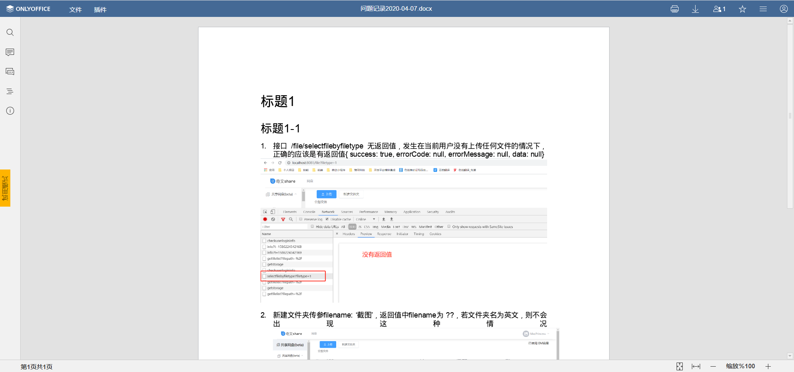

例如：word 文件在线编辑：
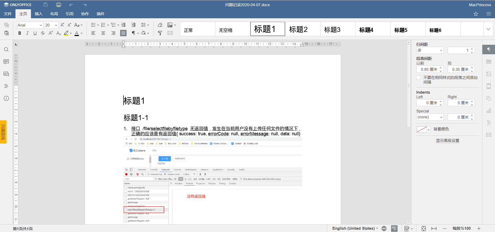

::: tip

本地启动时，office 文件在线预览需要在本地搭建 [only office](https://www.onlyoffice.com/) 服务；<br />
线上部署时，office 文件在线预览需要在服务器上搭建 [only office](https://www.onlyoffice.com/) 服务；

:::

### 视频在线预览

文件类型为视频时，点击即可打开预览窗口，展示播放列表，支持快进、后退、暂停、倍速播放、全屏播放、下载视频和折叠播放列表。

视频播放器使用了 [vue-video-player](https://github.com/surmon-china/vue-video-player) ，具体配置项请查看该项目的官方文档，外层播放列表和操作栏为自行封装的。


### 音频在线播放

MP3 格式的文件支持在线播放。


